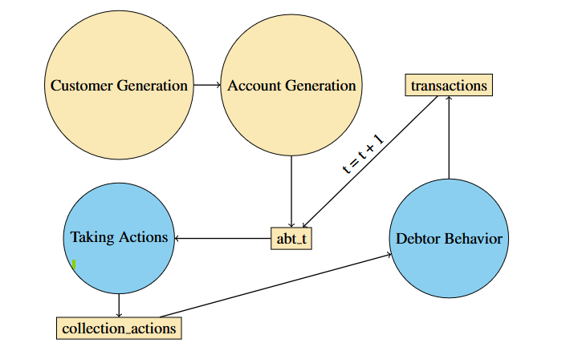
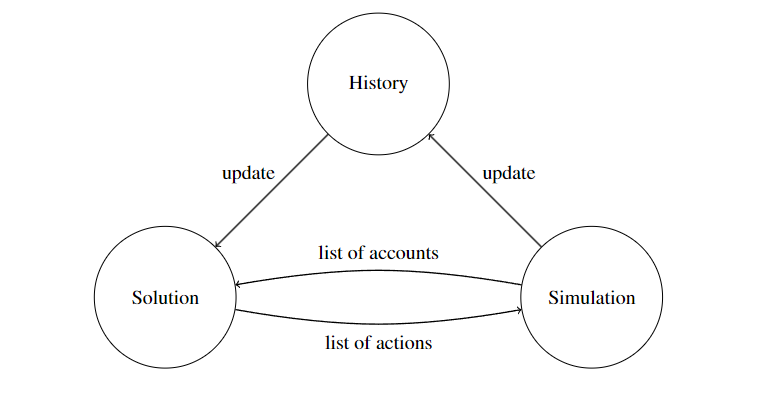

# RL Debt Collection

## Overview

RL Debt Collection is a project aimed at creating a robust and efficient system for managing and collecting debts using reinforcement learning techniques. The main loop runs in the **main.py** file, the decision making part is located in the **decision.py** file. The logic focuses around the _AccountPeriodInfo_ type, which contains the data for period based on the SAS-side **abt_x** (~state/observation), **transactions** and **collection_actions** tables. The decision function is able to access all the history of previous *AccountPeriodInfo*s through _accounts_histories_ by-aid dictionary.

## Prerequisites

- [Java](https://www.java.com/en/download/) (make sure it is added to PATH)
- Python >= 3.10

## Installation

To install the project, clone the repository and install the required dependencies in your Python (version >= 3.10) virtual environment:

```bash
git clone https://github.com/SKN-Business-Analytics/rl-debt-collection.git
cd rl-debt-collection
python -m venv venv
venv\Scripts\activate
python -m pip install -r requirements.txt
```

## Usage

Make sure that you have your virtual environment activated by executing:

```bash
venv\Scripts\activate
```

To run the project, execute the following command:

```bash
python python/main.py
```

## Common Issues

### Locks on SAS tables

Assure that you have closed all of your opened SAS tables (e.g. tables opened in SAS Enterprise Guide) to avoid LOCK errors.

## Additional Resources

- [SASPy Documentation](https://sassoftware.github.io/saspy/index.html)

## Graphics

### Graphical representation of the simulated debt collection process. Yellow nodes are written in SAS, blue nodes are written in Python. Rectangles represent SAS tables. t denotes the current period.



### Graphical representation of the workflow of the reinforcement learning solution during each period.


